# Teklo Studio — fresh readiness audit, 22 September 2026

**Verdict: NOT READY.** The requested homepage and five-product Shop changes are implemented and verified on unpublished **teklo-theme/dev, 196729798822**. Checkout still rejects orders. Full post-payment intake, proof delivery, written approval and fulfillment are not signed off.

[Development homepage](https://at3dshop.myshopify.com/?preview_theme_id=196729798822) · [Five-product Shop preview](https://at3dshop.myshopify.com/collections/shop?preview_theme_id=196729798822) · [Draft PR 3](https://github.com/CTheDev24/teklo-theme/pull/3)

This audit uses new browser captures and Shopify reads from this run. Earlier implementation reports are history, not fresh passing evidence. No theme publication, real payment, valid inquiry, subscription or customer message was sent. Synthetic cart items were removed; cart verified empty.

## Implemented changes and ownership

**Theme:** Restored Custom Work below the homepage cards, with an expandable, keyboard-operable Start a Conversation control and the existing Jotform embedded directly on the homepage. It supports the configured PDF/photo/STL/3MF intake and retains a direct new-tab fallback. Studio philosophy stays on Studio and the compact footer newsletter stays in place. Updated Home Objects copy and its collection link. Desktop and mobile Shop navigation now target `/collections/shop`; Trace retains its product destination.

**Shopify collection configuration:** Created manual collection **Shop**, GID `gid://shopify/Collection/693062697126`, handle `shop`, Online Store channel, manual order:

| Position | Product | Product ID | Reason selected |
|---|---|---|---|
| 1 | Trace | 15807121490086 | Launch centerpiece |
| 2 | Modern Art Deco Wall Clock | 15295976439974 | Sculptural ridges; ties to homepage photograph |
| 3 | Birch Pendant Light | 15295976341670 | Distinct lighting category and strong light/shadow photograph |
| 4 | Torio Planter | 8425970794662 | Open lattice geometry and warm styling |
| 5 | Luxar Planter | 8425971941542 | Contrasting spiral form and neutral photograph |

All were already ACTIVE products with stocked variants; no stock, prices, descriptions, product status, shipping profiles or physical specifications were changed. Listing descriptions support their identities; physical measurements/material claims were not independently certified. Wibble was excluded because its text promises five colors and a thickness choice while only three color variants are configured. Sold-out products and DRAFT Soft Face were excluded. The original Trace collection is unchanged. The new collection is Shopify-hosted content shared across themes; creating it does not publish the development theme.

## Fresh flow checks

1. **Homepage and Custom Work — pass for access/validation; delivery untested.** Homepage ends with cards, Custom Work invitation, compact footer. Enter opens the inquiry disclosure at 360px. Jotform loads labeled name, email, project, reference-link and optional upload fields. Blank submission shows three required-field errors and creates no inquiry. Configured accepted types: PDF/JPG/JPEG/PNG/WEBP/HEIC/STL/3MF, five files, 10 MB each. Fresh upload/storage/mailbox delivery was not exercised. Screenshots 01–02.
2. **Shop and filtering — pass.** Five products appear in the intended order, Trace first. Price ascending orders the $12 planters first and Trace last. Maximum price $1 returns zero of five with filter removal guidance. Canonical is `https://teklostudio.com/collections/shop`; title is `Shop – Teklo Studio`. Screenshots 03–04.
3. **Trace customization — partial.** Gallery/Signal Orange initially $149.95; selecting Nocturne and Match My Medal Color yields $174.95. Piece reference and gift note pass into cart. Pre-launch warnings remain and the purchase area has no usable customer intake handoff link. Screenshot 05. Current media screenshot 15 explicitly says MESSAGE US ON ETSY.
4. **Cart and checkout — cart pass; checkout blocked.** Added synthetic piece AUDIT-20260922-A, changed quantity 1→2, observed $349.90 with no 25OFF reduction, reloaded and verified values persisted. Checkout displays “This store isn’t set up to receive orders yet.” Current Admin store read confirms Pause and Build. At 390/360px the checkout button is inside the viewport, bottom about 828px in an 844px viewport; line contents scroll. Removed test item and verified empty cart. Screenshots 06–09.
5. **Mobile navigation — sampled pass.** At 360px menu opens with Shop/Trace/Studio/Custom Work destinations. Escape closes it and returns focus to Menu (`aria-expanded=false`). Shop has five cards and no horizontal overflow: 390px viewport/375px document and 360px/345px document. Homepage expanded form iframe remains within the 360px layout. Screenshots 10 and 18. These are controlled widths, not real iPhone/Android or touch certification.
6. **Policies — partial.** Fresh shipping/refund/terms text agrees on Trace production of 8–10 business days after approval, 7-day damage reporting, approval/cancellation and nonresponse rules. Support placeholders are absent in sampled shipping/refund text; both use support@. Terms exclude private fulfillment uploads from unrestricted feedback reuse. Privacy contains no GPX/route-specific retention detail. General shipping copy still advertises worldwide shipping and free shipping over $35 for non-Trace products, with a clear Trace exception. Screenshot 11 and accompanying fresh policy text files. Rates and eligibility for all five launch products remain untested.
7. **Recovery states — pass, with assortment caveat.** Truly empty Keep It Organized gives Browse available products instead of blaming filters. Nonsense search gives useful no-results advice. Intentional missing page gives 404 and Continue shopping. Empty-cart recovery points to the full `/collections/all` catalog, which includes items outside the five-product launch selection. Screenshots 12–14.
8. **Standard product — sampled pass, merchandising review needed.** Modern Art Deco clock adds to cart at $38.95, Brown|Off White, without Trace-only fields; removal returns the cart to empty. Default hero shows a blue clock while Brown|Off White is selected, so buyers need verified color-to-photo mapping. Screenshot 16. The remaining three added products were read in Shopify for content/stock and inspected in the grid; their individual cart paths were not exercised.
9. **Trace intake and operations — partial.** Fresh public Jotform read shows order number, order email, piece reference/number, GPX/activity-link/course research/course-map paths, and written-proof acknowledgments without an intake signature. Instructions describe 48-hour response, reminders, day-10 refund, and production hold. Duplicate Other choices appear under activity platform; finish time can be left empty without an explicit omit-time control. Screenshot 17 and saved DOM. No actual submission, private/invalid-file processing, two-piece reconciliation, proof send/reply or nonresponse execution was performed in this run.
10. **Technical/release gates — partial.** Theme Check: zero errors, ten existing warnings in actual theme files; none in this change. Backup copies under ignored review folders excluded from that count. Existing test suites: 10 Node proof-email tests and 22 Python Trace workflow/deadline tests pass. Four deployed files independently pulled back and matched after newline normalization. Junip/Hextom and Shopify pixel scripts are present in sampled Shop DOM; no event receipt, consent enforcement, purchase deduplication, real-mobile performance, screen-reader or 200% zoom pass is claimed.

## Original findings matrix

| ID | Current status | Evidence / next closure requirement |
|---|---|---|
| P0-01 | **Blocked: merchant plan/payment gate** | Fresh checkout error and Pause and Build read. Active plan and authorized test payment setup needed before shipping/tax/payment/confirmation/refund tests. |
| P0-02 | **Fixed/tested** | Header Shop leads to five-product collection; Trace CTA leads to product with starting price. |
| P0-03 | **Partial; launch blocker** | Piece reference persists; public intake exists, but product still warns handoff is being prepared and does not expose a verified intake route. Etsy graphic remains. Order email → intake → proof → written approval not exercised. |
| P1-01 | **Configured prices/text consistent** | Eight current variants use $149.95/$174.95; $25 copy matches. No automatic discount observed at quantity 2. Full graphic reconciliation still open. |
| P1-02 | **Text aligned; commercial tests blocked** | Trace exception is explicit and 7-day damage consistent. Test actual delivery/rates/thresholds for all five products after checkout activation. General non-Trace worldwide/free-shipping claims need configuration verification. |
| P1-03 | **Sampled placeholders fixed; delivery gate open** | Fresh shipping/refund/privacy use support@. No fresh support/hello receipt test or response-time commitment established. Contact-information policy not reread this run. |
| P1-04 | **Fixed in sampled text** | Product/refund/terms explicitly disclose custom-order exclusion, pre-approval refund and production cancellation boundary; earlier-order terms preserved. |
| P1-05 | **Staged for merchant measurements** | Homepage/product still say measurements being confirmed. Current graphic metadata still describes dimension annotations; no physical verification obtained. |
| P1-06 | **Partial; operational/legal sign-off open** | Terms protect private uploads, but fresh privacy page lacks route-specific 14-day detail. Verify provider/backups/manual deletion practice and publish accurate linked disclosure. |
| P1-07 | **Excluded from launch** | Fresh Shopify search confirms Soft Face remains DRAFT; copied description still exists, so do not reactivate without correction. |
| P2-01 | **Partial** | Shop title/canonical use Teklo; four featured vendors and general policy prose still use AllThings3DShop. |
| P2-02 | **Partial** | Trace text headings and current 13-image alt descriptions present. New assortment alt text is generic; Luxar lead image has blank admin alt. Screen-reader and informative graphics review remain. |
| P2-03 | **Fixed/tested** | Empty collection distinguishes actual emptiness from filtering. |
| P2-04 | **Deferred: configuration/performance evidence missing** | Junip/Hextom present. No current-run need/configuration review or measured mobile performance result. No app disabled speculatively. |

Additional P2: long marketplace-style product titles dominate mobile cards; shorten display titles without losing useful SEO or handles. Standard-product color/photo mapping needs review. Recovery links currently widen discovery beyond the curated assortment. Intake duplicate Other choice and omit-time handling need cleanup before full operational testing.

## Consolidated review and smallest remaining backlog

1. **Merchant-only activation:** choose active selling plan/payment test details. Then test one Trace and standard-product/mixed baskets across intended US destinations, including Alaska/Hawaii, rates/tax, order confirmation and refund. Paid commitments and publication remain human gates.
2. **Trace facts and media:** supply measured exterior/insert/map dimensions and verify available accent/color photographs. Correct Etsy, dimensions and assortment graphics; replace pre-launch handoff copy only after the real workflow passes.
3. **End-to-end operations:** connect the verified intake link in purchase/order-email guidance; exercise two differently personalized pieces, invalid GPX/private link/unavailable course, missing time/name/medal details, version-specific proof delivery and written approval. Verify reminder/refund handling and no production on silence. Local tests passing do not close this gate.
4. **Privacy and assortment readiness:** publish route handling/retention language reflecting tested deletion across Jotform/Drive/local copies; verify the general shipping/free-shipping/return promises for the four added products. Standardize old branding and map variant images. Do not invent new terms or measurements.
5. **Release sign-off:** fresh receipt and consent tests in the chosen analytics destination, authorized email delivery tests, real-device/touch/zoom/screen-reader checks and measured mobile performance; then final code/content review and separately authorized publication. Discounts remain disabled.

## Exact deployment and rollback

Theme files changed: `templates/index.json`, `sections/header-group.json`, `sections/teklo-custom-invitation.liquid`, `assets/teklo-custom-work.css`. Deployed only these files using `--nodelete` to unpublished theme 196729798822. Section schema/styles were uploaded before the JSON settings. Remote header already contained Trace product and Shop-to-Trace URLs absent from Git; preserved the Trace URL and changed only Shop's destination. No Shopify menu object was edited.

Before/after remote copies: local ignored `review/homepage-assortment-before/` and `review/homepage-assortment-after/`. To restore exact pre-change draft behavior, push the four matching before files to the same theme with `--only` for each and `--nodelete`. Alternatively revert this implementation commit, preserving the already-existing remote Trace URL, and restore Shop URL `/collections/trace` before redeploying. Never push an entire backup theme.

Collection rollback is separate: after restoring navigation, open Shopify collection 693062697126 and remove its Online Store availability (retain it unpublished for recovery). The collection did not exist before this change. Do not delete products, change their status or modify the existing Trace collection. No Jotform settings/notifications, Drive sharing, Shopify policies, prices, discounts, payments, shipping profiles or published-theme files were mutated in this batch.

## Screenshot evidence

The following are saved and visually inspected screenshots from this run. See the numbered flow checks above for interpretation and limits.

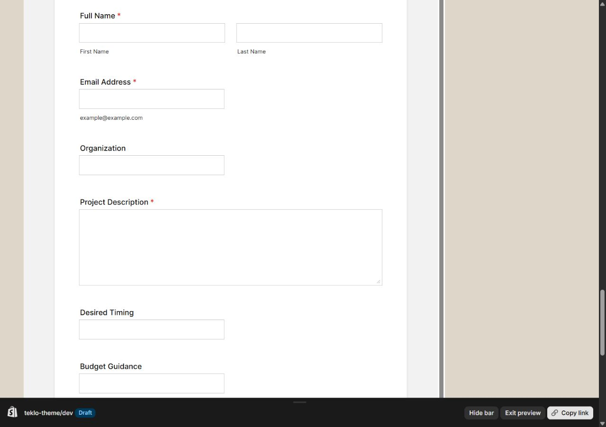

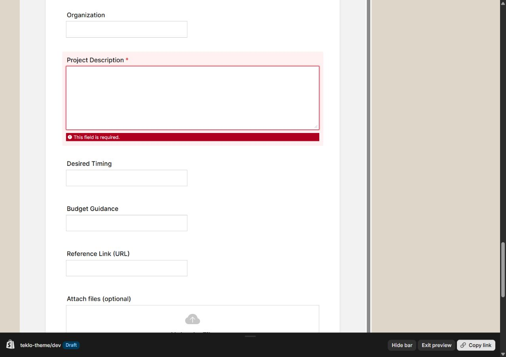

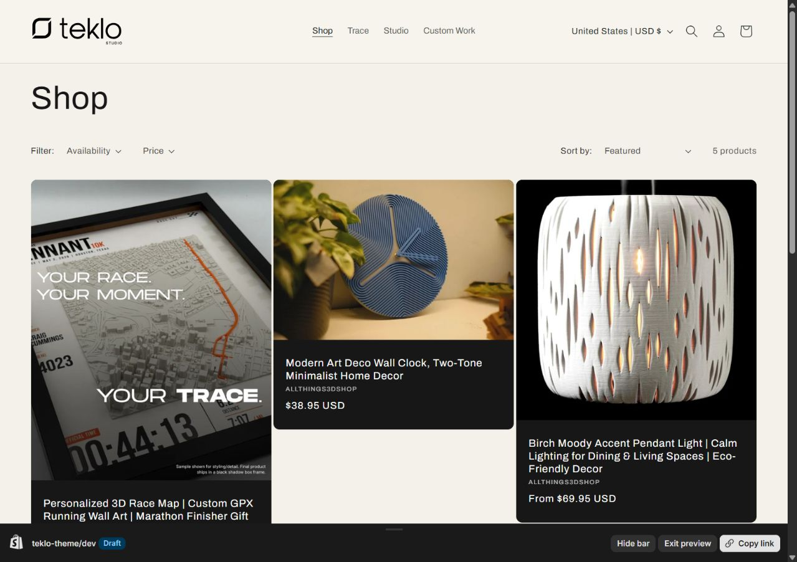

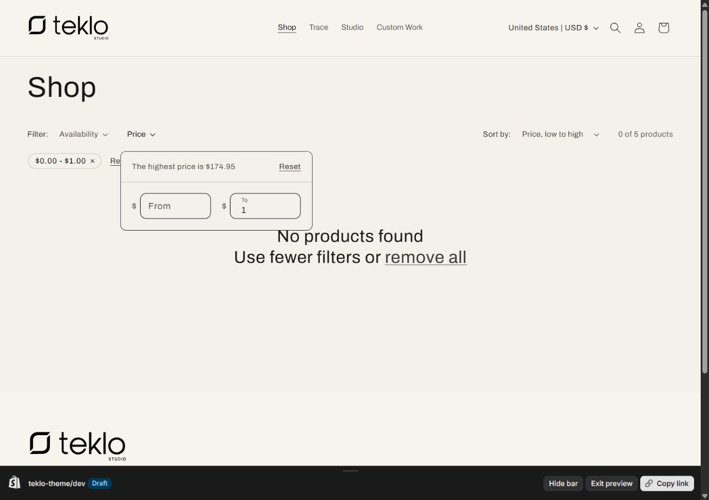

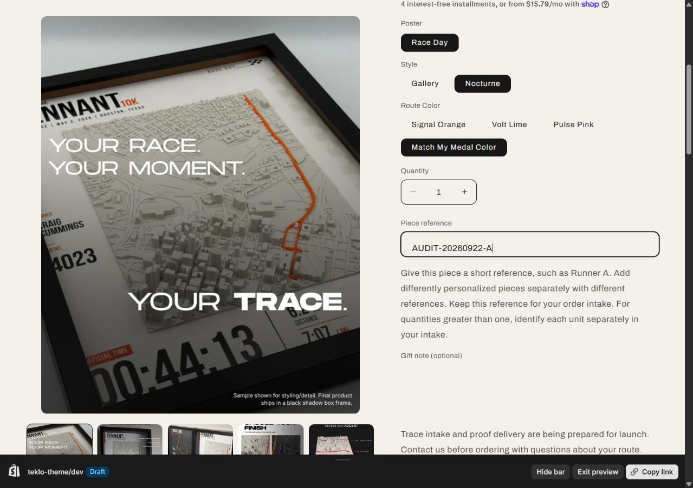

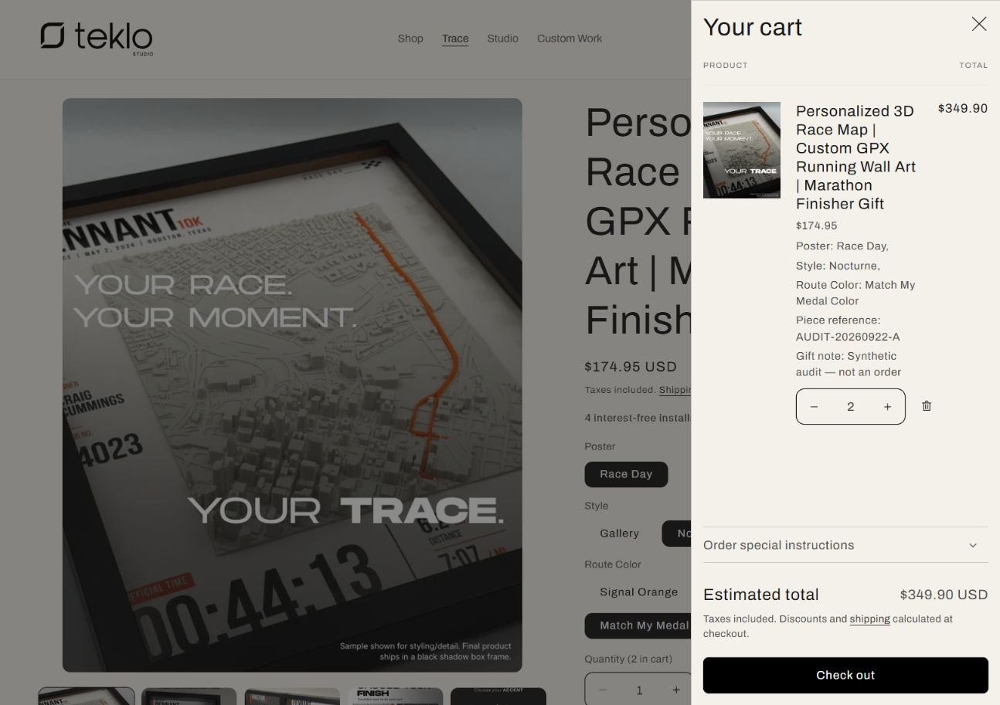

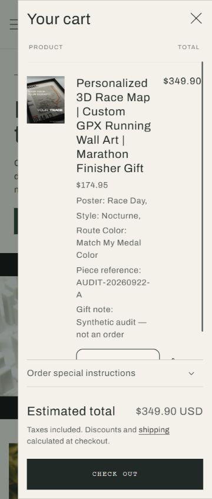

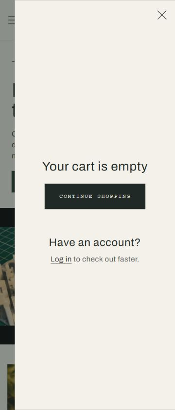

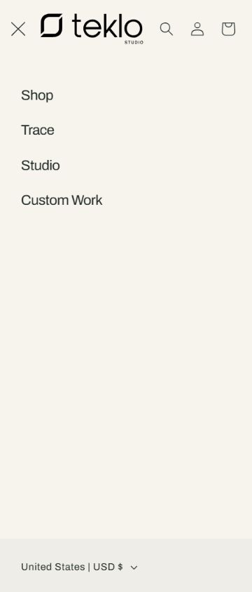

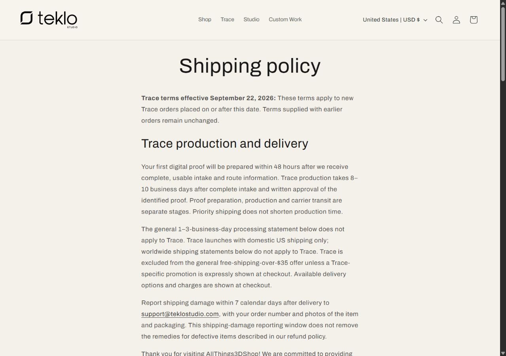

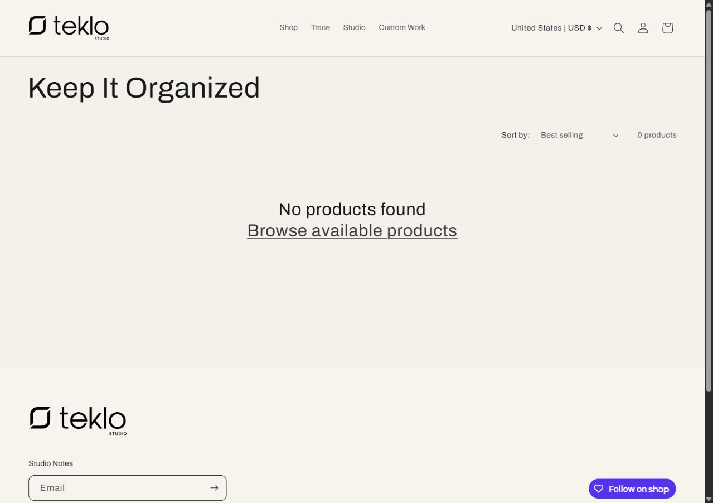

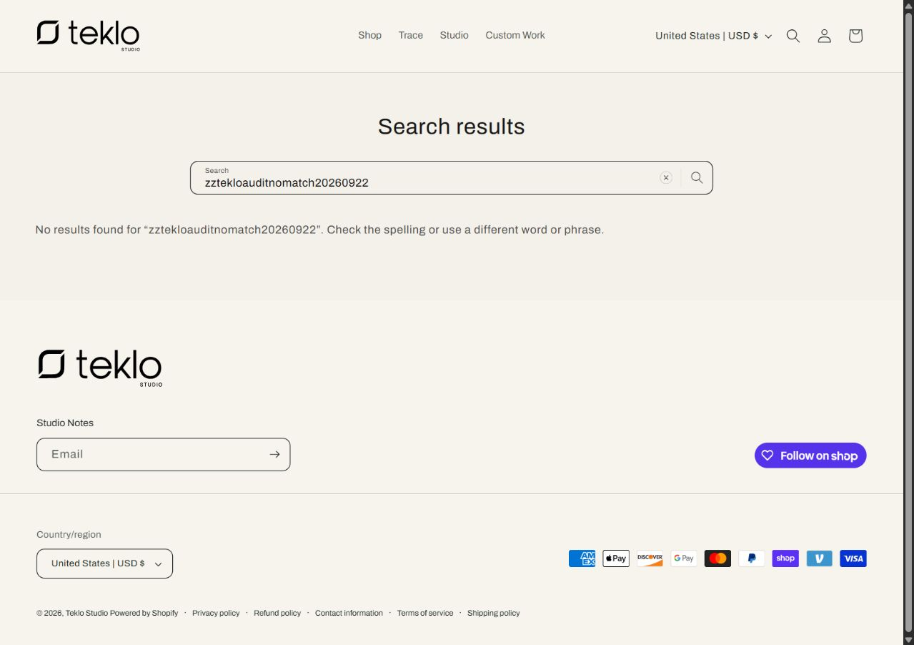

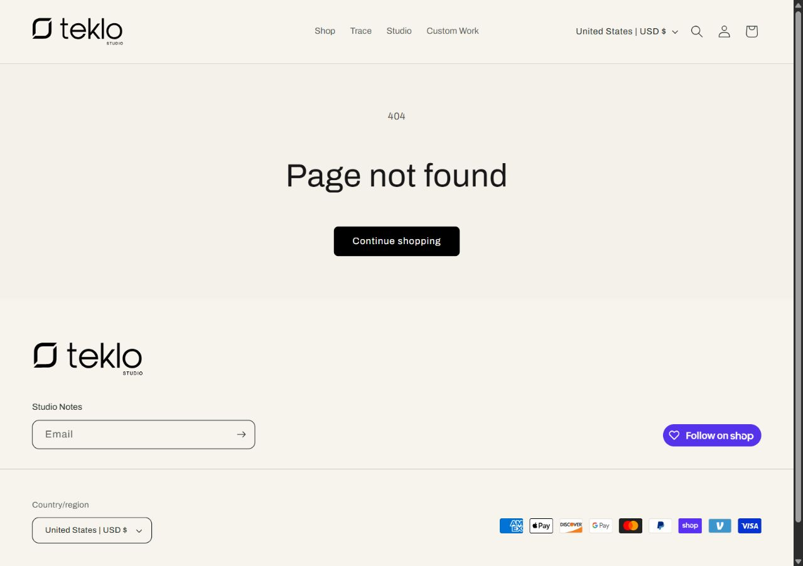

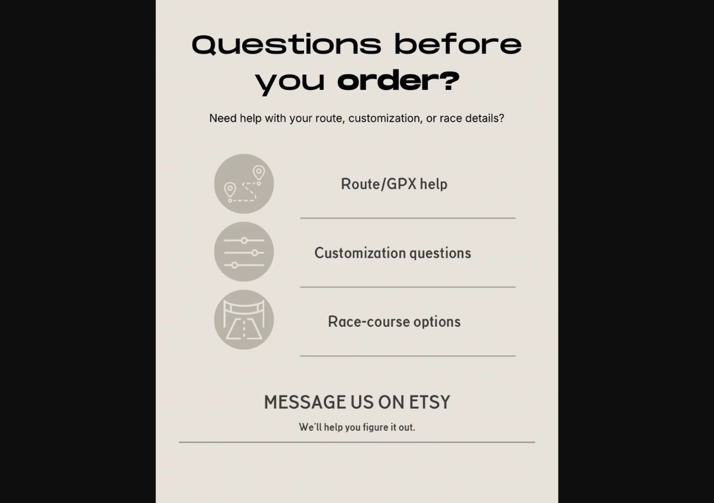

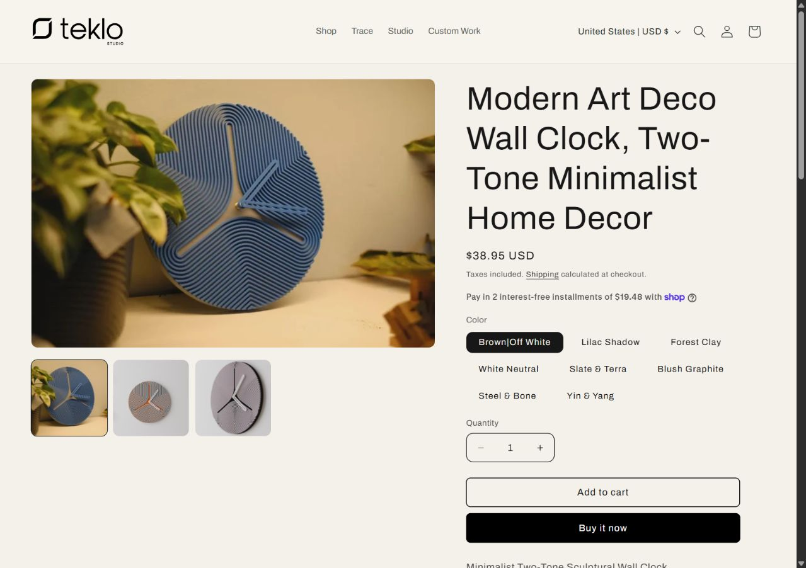

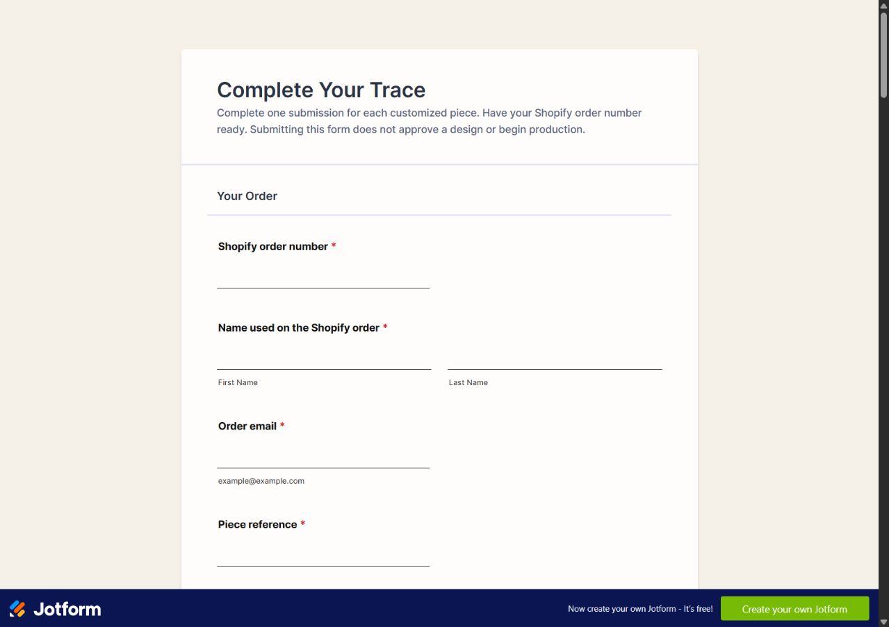

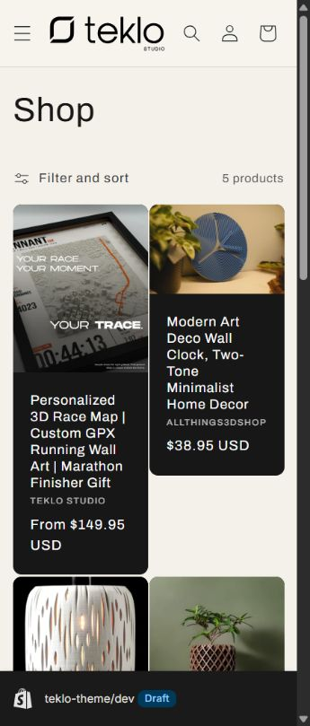
